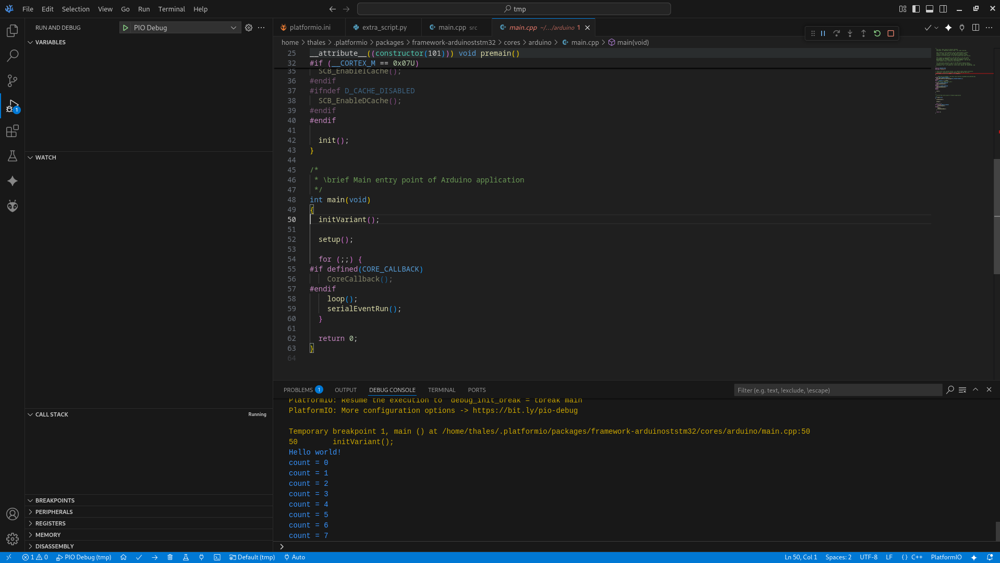

Original Post: https://fahren.com.br/semihosting-advanced-debugging-for-embedded-devices/

# Semihosting: Advanced Debugging for Embedded Devices?

## Introduction

From time to time, I need to develop embedded systems. Each one has its own particularities. However, regardless of the architecture -- ARM, RISC, or x86 -- debugging is essential. For microcontrollers, this is not a trivial task. Adding breakpoints, halting the code, and watching variables often demands external hardware and a dedicated communication line.

Each microcontroller has its own debug interface: JTAG, ST-Link, and the classical UART `print`. The print function is essential, not only for running applications but also to understand the flow of the executed tasks.

In my use case, I generally use Espressif and STM32 devices. I use the first one for IoT capabilities and applications with looser timing demands, like instrumentation, slow actuators, or bridging other devices. Espressif wireless interfaces always prioritize connectivity over other tasks, which can be a concern for real-time usage.

Imagine a power electronic device modulating a sinusoidal wave output. The control loop and PWM must be consistent with time periods; otherwise, a shoot-through can occur and burn everything. This is where the STM32 solves my problem.

Thus, the STM32 is a great tool for fast ADC and data processing. On top of everything, it has many available frameworks, with great emphasis on the STM32duino project.

There is also a third option: a hybrid solution that uses both worlds. The real-time needs are processed using the STM32, while connectivity and the user interface are managed by the ESP32. Those devices can also be programmed in different ways and interfaces. This is where I present MicroPython to my students.


## IDE

During my journey, I've tried everything. From Eclipse and Arduino IDE to self-customized editors. By far, PlatformIO is the best solution. Not only for having a large community but also because it is simple, easy to install, lightweight, and best of all: it just works.

Using PlatformIO avoids the need for complex explanations. Starting to code and debug is extremely fast. The only thing I would like to add is that I prefer VSCodium over VSCode, a discussion for another time.

## Semihosting

I was scratching some code a few days ago, and I just wanted to print something to the console. Since I was using ST-Link for programming and debugging, I thought it was going to be easy. Unfortunately, after thinking for a while, I realized it is not.

The standard `printf` function targets the standard output, which usually translates to a physical Serial Port (UART) on microcontrollers. While the ST-Link connects to the device via SWD (Serial Wire Debug) for flashing and controlling the core, it does not automatically forward the UART data to your PC unless you have specific hardware wiring (like connecting the RX/TX pins to a USB-to-TTL converter). Without Semihosting or a Virtual COM Port properly configured, your `printf` calls are essentially shouting into the void, as the debug probe is strictly listening for debug instructions, not standard I/O streams.

After some reading, I found an awesome document from [Valerii Koval](https://www.linkedin.com/in/valeros/) at [PlatformIOLabs](https://piolabs.com/blog/insights/debugging-semihosting.html), which explained simply what I was looking for: Semihosting.

> (...) convenient way of sending status messages to a debug console on a host machine. This possibility can greatly help to less invasively monitor the behavior of an embedded application without stopping the whole program flow. (...)

## The problem

After reading here and there, I took my Bluepill (STM32F103C6T8), plugged in my ST-Link adapter, and tried to replicate it without success. The main reasons were:

 - C++
 - Arduino Framework

 I wasn't capable of finding the answer on my own. [Maximilian Gerhardt](https://community.platformio.org/t/debugging-with-platformio-part-4-using-semihosting-on-arm-targets/29674/16) pointed out the fix. In the end, I'm just the storyteller responsible for putting the information together.

 ## Hands-on

You need to configure two files: `platformio.ini` and `extra_script.py`.

 ```toml
[env:bluepill_f103c8]
platform = ststm32
board = bluepill_f103c8
framework = arduino
upload_protocol = stlink

upload_flags = -c set CPUTAPID 0            ; Allow Original and Clone STM32 to be detected by OpenOCD debugger.
debug_build_flags = -O0 -ggdb3              ; Apply no optimization to the code written.

build_unflags =
    --specs=nosys.specs 
    -lnosys

extra_scripts = extra_script.py              ; The "extra_script.py" file must be located in the main project folder

debug_extra_cmds =
    monitor arm semihosting enable
    monitor arm semihosting_fileio enable

test_testing_command =
    ${platformio.packages_dir}/tool-openocd/bin/openocd
    -s
    ${platformio.packages_dir}/tool-openocd
    -f
    openocd/scripts/board/stlink.cfg
    -c
    init
    -c
    arm semihosting enable
    -c
    reset run
```

```python
Import("env")

env.Append(
    # Use the semihosted version of the syscalls
    LINKFLAGS=[
        "-Wl,--whole-archive",
        "-lrdimon_nano",
        "-Wl,--no-whole-archive"
    ],
)
```

Here is the magic trick. By default, the ARM toolchain uses `nosys.specs` (no system), which provides empty implementations for system calls like write or read. In `platformio.ini`, we instruct the build system to remove these default specs (`build_unflags`) and configure OpenOCD to enable semihosting monitoring.

The `extra_script.py` handles the linker phase. It forces the application to link against `librdimon_nano`. This library implements the necessary system calls to forward I/O operations (like `printf`) from the microcontroller through the debugger probe directly to the host machine's console.

Now that everything is ready, you just need to call `initialise_monitor_handles(void)` before the print function.

```C++
#include <Arduino.h>
int count = 0;


extern "C" void initialise_monitor_handles(void);

void setup()
{
  initialise_monitor_handles();
  printf("Hello world!\n");
}

void loop() {
  delay(500);
  printf("count = %d\n", count++);
}
```

The files structure inside PlatformIO is as follow:

```bash
$ tree
.
├── extra_script.py
├── platformio.ini
└── src
    └── main.cpp

2 directories, 3 files

```


Now, you should be able to see the result in the debug console.




## Conclusion

At first sight, semihosting doesn't seem that spectacular. However, it simplifies the workflow, mainly in combination with the debug device. Identifying some code condition without stopping the execution is valuable. In the end, doing all that without the need to configure the UART interface and use a converter seems to be a good alternative.